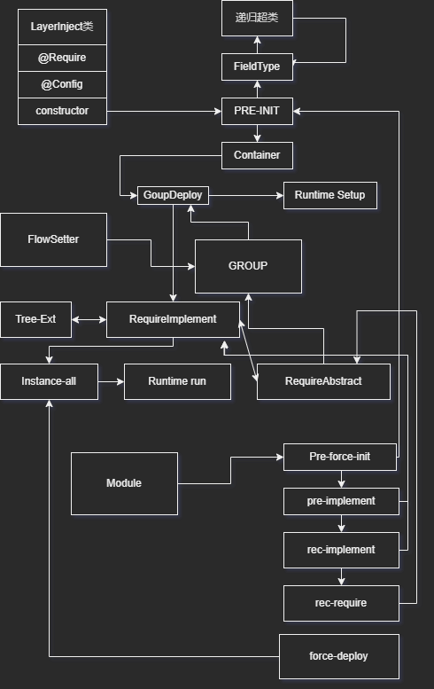

```java
/*
 * This Java source file was generated by the Gradle 'init' task.
 */
package layer;

import layer.annotations.Module;
import layer.entity.*;
import layer.layer.Logger;
import org.junit.Test;
import layer.annotations.*;


public class LibraryTest {
	@LayerClass
	class console extends layer.entity.Layer {
		public void log(String... name) {
			System.out.println(String.join(" ", name));
		}
	}
	
	@LayerClass
	class fs extends Layer {
		@Require
		Logger logger;
		@Config()
		String version = "0.0.1";
		
		public void printName() {
			logger.warn("fs版本 v" + version + " 已经过时,强制运行会导致爆炸");
		}
	}
	
	@LayerClass
	class fs_mysql extends fs {
		@Override
		public void setup() {
			version = "0.0.2";
		}
	}
	
	@LayerClass
	class run extends Layer {
		@Require()
		fs fs;
		@Require
		Logger logger;
		
		@Override
		public void run() {
			logger.suc();
			logger.suc("mount <-> success");
			fs.printName();
			fs.logger.info("run finish %s", "code 0");
		}
	}
	
	@Provider
	class p0 extends LayerProvider {
		public String name = "p0";
		@Require()
		@Import(name = "ch")
		p1 p1;
	}
	
	@Provider
	class p1 extends LayerProvider {
		public String name = "p1";
		@Require
		Logger logger;
	}
	
	@Controller
	class c0 extends LayerController {
		@Require()
		p0 p0;
		
		public void test() {
			p0.p1.logger.info("..child.child.logger init ..");
		}
		
		@Override
		public void run() {
			test();
		}
	}
	
	@Module(name = "ch")
	class module_ch extends LayerModule {
		public module_ch() {
			provider(new p1());
		}
		
		@Override
		public void handelInstance(Instance ins) {
			ins.instance("logger",new Logger());
		}
	}
	
	@Module(name = "main")
	class module_main extends LayerModule {
		public module_main() {
			controller(new c0());
			provider(new p0());
			imports(new module_ch());
		}
	}
	
	
	@Test
	public void someLibraryMethodReturnsTrue() {
		new Instance()
			.deployInfo()
			.provide(
				new console(),
				new fs(),
				new fs_mysql(),
				new run()
			)
			.instance("fs-logger", t -> t
				.implement(new Logger())
				.config("name", "fs")
			)
			.instance("run-logger", t -> t
				.implement(new Logger())
				.config("name", "run")
			)
			.instance("console")
			.instance("fs_mysql", t -> t.require("logger", "fs-logger"))
			.instance("fs", t -> t
				.config("name", "hhh")
				.require("console")
				.require("logger", "fs-logger")
			)
			.instance("run", t -> t
				.require("fs", "fs_mysql")
				.require("logger", "run-logger")
			)
			.deploy();
		new MInstance()
			.deployInfo()
			.module(new module_main())
			.deploy();
	}
}

```

output
```shell

> Task :lib:compileJava UP-TO-DATE
> Task :lib:processResources NO-SOURCE
> Task :lib:classes UP-TO-DATE
> Task :lib:compileTestJava UP-TO-DATE
> Task :lib:processTestResources NO-SOURCE
> Task :lib:testClasses UP-TO-DATE
> Task :lib:test
Picked up _JAVA_OPTIONS: -Djava.net.preferIPv4Stack=true

[2023/12/12 18:52:31][Manager][DEPLOY] [fs-logger] implement Logger no description
[2023/12/12 18:52:31][Manager][DEPLOY] [run-logger] implement Logger no description
[2023/12/12 18:52:31][Manager][DEPLOY] [console] implement console no description
[2023/12/12 18:52:31][Manager][Require] [fs_mysql] logger = <fs-logger>implement Logger abstract Logger
[2023/12/12 18:52:31][Manager][DEPLOY] [fs_mysql] implement fs_mysql no description
[2023/12/12 18:52:31][Manager][Require] [fs] logger = <fs-logger>implement Logger abstract Logger
[2023/12/12 18:52:31][Manager][DEPLOY] [fs] implement fs no description
[2023/12/12 18:52:31][Manager][Require] [run] logger = <run-logger>implement Logger abstract Logger
[2023/12/12 18:52:31][Manager][Require] [run] fs = <fs_mysql>implement fs_mysql abstract fs
[2023/12/12 18:52:31][Manager][DEPLOY] [run] implement run no description
[2023/12/12 18:52:31][Manager][INFO] deploy all use Σ = 23ms
[2023/12/12 18:52:31][I][SUCCESS] 
[2023/12/12 18:52:31][I][SUCCESS] mount <-> success
[2023/12/12 18:52:31][I][WARN] fs版本 v0.0.2 已经过时,强制运行会导致爆炸
[2023/12/12 18:52:31][I][INFO] run finish code 0
[2023/12/12 18:52:31][Manager][Require] [p1] logger = <logger>implement Logger abstract Logger
[2023/12/12 18:52:31][Manager][DEPLOY] [p1] implement p1 no description
[2023/12/12 18:52:31][Manager][DEPLOY] [logger] implement Logger no description
[2023/12/12 18:52:31][Manager][INFO] deploy all use Σ = 1ms
[2023/12/12 18:52:31][Manager][Require] [c0] p0 = <p0>implement p0 abstract p0
[2023/12/12 18:52:31][Manager][DEPLOY] [c0] implement c0 no description
[2023/12/12 18:52:31][Manager][Require] [p0] p1 = <ch.p1>implement p1 abstract p1
[2023/12/12 18:52:31][Manager][DEPLOY] [p0] implement p0 no description
[2023/12/12 18:52:31][Manager][INFO] deploy all use Σ = 1ms
[2023/12/12 18:52:31][I][INFO] ..child.child.logger init ..
[2023/12/12 18:52:31][MI][INFO] deploy success use Σ = 12ms
BUILD SUCCESSFUL in 1s
3 actionable tasks: 1 executed, 2 up-to-date
18:52:31: 执行完成 ':lib:test --tests "layer.LibraryTest.someLibraryMethodReturnsTrue"'。

```